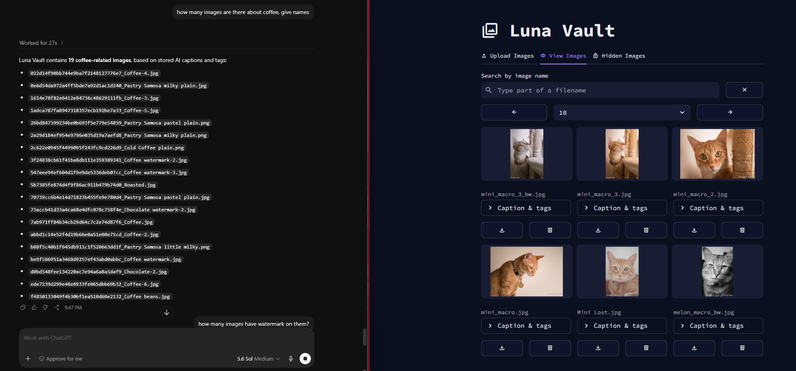
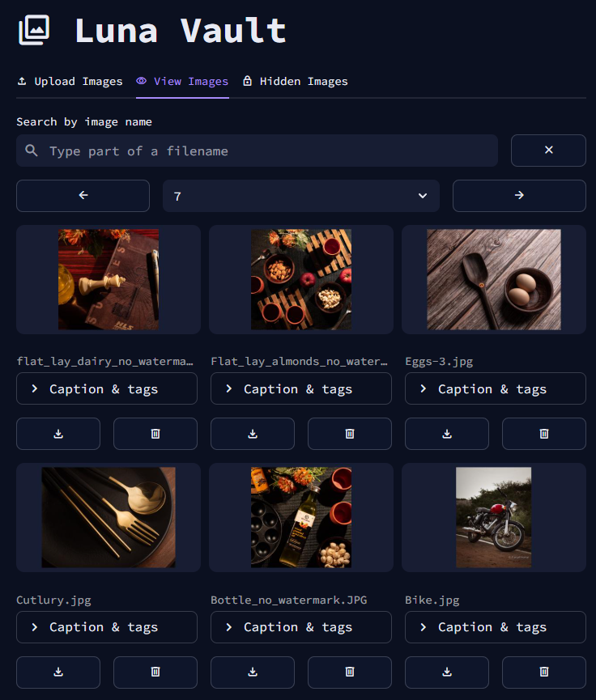
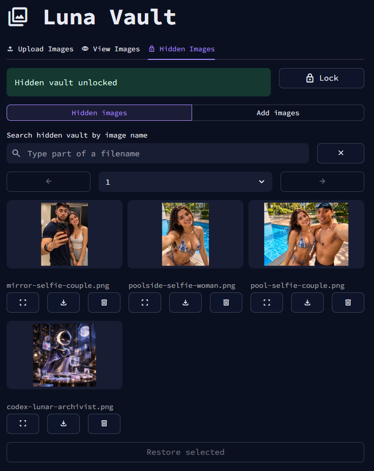

# Luna Vault


## Generate, Manipulate, Search and Store images of your choice using LLMs.

Luna Vault is an AI-powered, private image library that runs locally. Its Ollama
vision model analyzes every upload automatically, creates a concise caption and
searchable tags, and stores that metadata in PostgreSQL. FastMCP makes the indexed
collection available to AI assistants of your choice (ChatGPT here) for fast search and safe image-management
operations without repeatedly opening every original image.

The Streamlit interface lets you upload, search, view, download, hide, restore,
and delete images. Image data, metadata, and AI models persist in Docker volumes,
while the password-protected hidden vault stays separate from normal galleries
and searches.

<p align="center">
  
</p>

An MCP-connected AI assistant can query Luna Vault's generated captions and tags,
answer collection-level questions, and return matching filenames without visually
reprocessing every original image.

Luna Vault is also well suited to bulk image manipulation and editing workflows.
Its MCP tools let an AI assistant find and act on groups of images while keeping
the stored files and their searchable metadata synchronized.

<p align="center">
  
</p>

The main gallery provides filename search, pagination, AI-generated captions and
tags, full-size viewing, downloads, and deletion controls.

<p align="center">
  
</p>

The hidden vault keeps private images behind a password and supports adding,
viewing, downloading, restoring, searching, and deleting them separately.

<p align="center">
  
</p>

An example image stored in the password-protected hidden gallery. yah... i know...

## Run

Optionally set `POSTGRES_PASSWORD`, then build and start:

```sh
docker compose up --build
```

Compose automatically pulls the configured vision model into the persistent
`ollama_data` volume before starting MCP. Open Luna Vault at
<http://127.0.0.1:18501>. The Hidden Images tab lets you create a password and an
exactly 8-digit reset PIN; both are salted and hashed in PostgreSQL.

## Vision model

The default model is `qwen2.5vl:7b`. To use a different Ollama vision model,
set `VISION_MODEL` before starting the stack. For example, use Llama 3.2 Vision 11B:

```sh
export VISION_MODEL=llama3.2-vision:11b
```

Ollama runs only on the private Compose network. No API key or external image
service is used. The `ollama-pull` Compose service downloads the selected model
once into the persistent `ollama_data` volume, and MCP waits for that step to
finish before it starts.


## Database UI

Adminer is available at <http://127.0.0.1:19080> after starting the stack. Use:

- System: `PostgreSQL`
- Server: `postgres`
- Username: `lunavault`
- Password: your `POSTGRES_PASSWORD`, or `lunavault-dev` when unset
- Database: `lunavault`

Adminer is bound to localhost and reaches PostgreSQL only through the private Luna Vault network. The database port itself remains unavailable from the host.

Check GPU use while analysis is active:

```sh
docker compose exec ollama ollama ps
nvidia-smi
```

If NVIDIA passthrough is unavailable, remove `gpus: all` from the Ollama service to use the CPU fallback. Captioning will still work but will be slower.

## MCP tools

Luna Vault exposes these tools to connected MCP clients:

- `list_images` — list visible images with captions and tags.
- `view_image` — return a visible image.
- `add_image` — add an image and generate metadata.
- `modify_image` — replace a visible image and refresh its metadata.
- `update_image_metadata` — update a visible image's caption and/or add or remove tags without replacing the image or re-running vision analysis.
- `remove_image` — delete a visible image and its metadata.
- `search_images` — search captions and tags without opening original images.
- `backfill_metadata` — generate missing or stale metadata for imported files.

Hidden-vault password and session endpoints are UI-only custom routes, not MCP tools.
## Metadata and search

Every add, upload, or replacement is analyzed before it is committed. The generated caption, normalized tags, content hash, model name, and timestamps are stored in PostgreSQL. Deletion removes the file and its metadata consistently.

The MCP tool:

```text
search_images(
  query: str = "",
  tags: list[str] | None = None,
  match_all_tags: bool = False,
  limit: int = 50,
  offset: int = 0
)
```

returns `{query, normalized_query, count, results[]}`, where each result contains `name`, `caption`, `tags`, and `updated_at`. Search reads the metadata index and never opens original images. PostgreSQL uses a generated weighted `tsvector` with a GIN index for English caption/tag full-text search and a second GIN index for tag array queries.

Run or resume an idempotent metadata backfill through the MCP `backfill_metadata` tool after importing images outside the normal ingestion flow.

## Development

The UI source is bind-mounted at `/workspace/ui` and Streamlit reloads on edits. The MCP source is bind-mounted at `/workspace/mcp`; restart MCP after editing:

```sh
docker compose restart mcp
```


### UI modules

- `ui/app.py` — the small Streamlit entry point: creates the three tabs, loads image metadata, and passes data to each page.
- `ui/config.py` — reads UI environment settings such as the image directory, API URL, gallery size, and supported image formats.
- `ui/pages/shared.py` — shared session state, thumbnail caching, pagination, filename display, and gallery utilities.
- `ui/pages/upload_page.py` — upload handling, progress feedback, and display of newly generated captions and tags.
- `ui/pages/view_page.py` — visible-image search, gallery display, full-image viewing, downloads, and deletion.
- `ui/pages/hidden_page.py` — hidden-vault authentication, hiding/restoring images, and hidden-image viewing, downloads, and deletion.
- `ui/pages/__init__.py` — marks the page directory as a Python package.
- `ui/.streamlit/config.toml` — Streamlit theme settings.
- `ui/requirements.txt` — Python dependencies used by the UI container.
- `ui/Dockerfile` — builds the UI container image.

### MCP modules

- `mcp/server.py` — FastMCP server entry point and the public image-management tools.
- `mcp/vault.py` — image ingestion, metadata backfill, safe file operations, and search orchestration.
- `mcp/vision.py` — Ollama vision requests plus validation and normalization of captions and tags.
- `mcp/database.py` — PostgreSQL schema setup and metadata/search-index persistence and queries.
- `mcp/security.py` — password and PIN handling plus hidden-vault authentication and sessions.
- `mcp/config.py` — reads and validates MCP settings, including database, image, Ollama, and vision-model configuration.
- `mcp/__init__.py` — marks the MCP directory as a Python package.
- `mcp/tests/` — automated tests for vault behavior, metadata processing, and security safeguards.
- `mcp/requirements.txt` — Python dependencies used by the MCP container.
- `mcp/Dockerfile` — builds the MCP container image.
The dark theme is in `ui/.streamlit/config.toml`. Stop the stack with `docker compose down`; named volumes remain.
